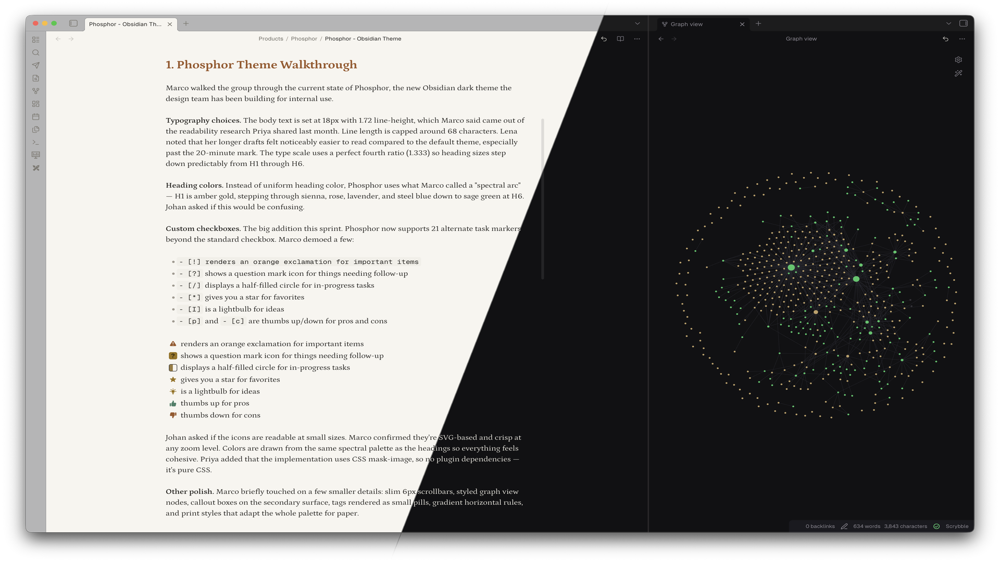

# Phosphor

An Obsidian theme for deep-focus writing and reading.

Named for the soft, persistent glow of phosphorescent ink — text that lingers in the mind after the page goes dark.

## Features

- **Spectral arc headings** — warm amber (H1) through cool sage (H6), mirroring natural reading energy
- **Tuned for long-form reading** — 18px base, 1.72 line-height, ~68ch measure, perfect fourth type scale
- **Dark and light modes** — both built around the same warm-to-cool palette
- **20+ custom checkboxes** — icons for tasks like `[!]` important, `[?]` question, `[/]` in-progress, `[I]` idea, `[b]` bookmark, `[P]` PR open, `[M]` PR merged, and more
- **Pure CSS** — no build tools, no dependencies, just `theme.css`

## Typography

| Element | Font |
|---------|------|
| Body | Source Serif 4 |
| Interface | Inter |
| Code | JetBrains Mono |

## Install

**Settings** > **Appearance** > **Themes** > search **Phosphor** > **Install and use**

## Author

Johan Viberg
